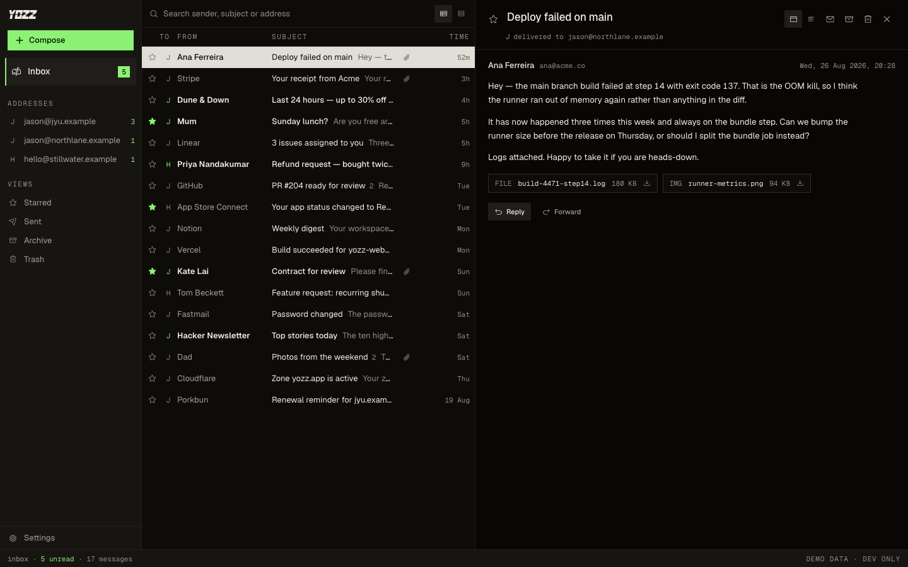

<div align="center">


# YOZZ

**Zero-knowledge webmail for the addresses you already own.** Reads over IMAP, sends over SMTP,
and never gives YOZZ's servers readable access to your mail.

[](https://github.com/fishballapp/yozz/actions/workflows/ci.yml)
[](./LICENSE)
[](#licence)
[](https://www.npmjs.com/package/@yozz.app/tls)

[yozz.app](https://yozz.app) · [Issues](https://github.com/fishballapp/yozz/issues)



<sub>Fixture data from the dev-only demo mode; every name and address is fictional.</sub>

</div>

Google removes "Send mail as" for third-party addresses in January 2027, after killing POP fetch
and Gmailify in January 2026. If you send from a domain you own through Gmail's interface, that
stops working. YOZZ is the client for that case: add any address with an IMAP or SMTP server and
send from it, with no limit on how many. An address with no inbox attached is the normal case
here, not an error.

The other half is what YOZZ leaves out. It has fewer features than Gmail on purpose: one dark
surface, threads, archive, trash, stars, a Markdown composer. Every addition has to displace
something.

## How it works

The browser does the mail. It opens TLS 1.3 to your IMAP and SMTP servers itself, with a TLS
and X.509 implementation in TypeScript, and reaches them through a relay on our side that
forwards bytes it cannot read. Your mail passwords never leave your device: YOZZ stores them
encrypted with a key only you hold, and our servers keep ciphertext they cannot open. If we were
breached or subpoenaed, there is no readable mailbox or credential store to hand over.

That is the scope of **zero-knowledge** here: YOZZ's infrastructure cannot read your credentials,
vault records or mail crossing the relay. YOZZ does not add end-to-end encryption to email, and
your existing mail provider retains whatever access it already has. We also retain the operational
metadata needed to run the vault and relay; [the architecture](./ARCHITECTURE.md#what-is-on-yozzs-servers)
spells out that boundary.

Two things do get stored with us, sealed: the drafts you write, so one started on a laptop is on
your phone, and mail sent from an address that has no mailbox to keep a copy in. Both are
ciphertext under your key, like your stored passwords.

Received HTML renders in a sandboxed frame with no network, remote images off until you ask, and
a switch to the sender's plain-text part. Inbox and Sent are threaded together and cached on the
device; nothing is synced through us.

## Works with your agent

The tab registers six [WebMCP](https://webmachinelearning.github.io/webmcp/) tools, so an agent
that drives your browser (ChatGPT's desktop browser, Chrome with
`chrome://flags/#enable-webmcp-testing`) can work the mailbox with you: `get_addresses`,
`get_threads` (find and read, rows or whole conversations), `update_threads` (read, starred, and
which mailbox), `save_draft`, `delete_draft`, and `navigate` to put something on your screen. It is
the only place an agent *can* read this mail: our servers hold ciphertext.

Reading changes nothing, on screen or in the mailbox; `navigate` is what shows you a conversation,
and it says so. **Nothing is sent by a tool.** A draft the agent writes is stored encrypted in your
vault, so it is waiting in Drafts on every device you use, and you press Send. The tools live in
`apps/web/src/agent/`.

## Status

Early. The hosted app at [yozz.app](https://yozz.app) is the one we use ourselves and it is not
finished: no mobile app, no notifications while the tab is closed, one live connection per
address while the tab is visible. The protocol libraries are the mature part; the numbers they
must print are in [docs/gates.md](docs/gates.md).

This repository is an exported copy of a private monorepo, so it has no pull requests and its
history is one commit per snapshot. Self-hosting is possible (`apps/worker-api/wrangler.jsonc`
and `.dev.vars.example` list what the worker needs) but not something we document or support.

## What is in this repository

`packages/` is what you can install from npm, MIT. `internal/` is workspace-only code the apps
share, and `apps/` is what runs at yozz.app; both AGPL-3.0.

| Package | What it is | Licence |
| --- | --- | --- |
| [`packages/x509`](packages/x509/) | Strict DER, certificate decoding, RFC 5280 path validation, a compiled trust store built from curl's `cacert.pem`. x509-limbo: 902/902 accepts, 8827/8837 rejects, each over-accept attributed. | MIT |
| [`packages/tls`](packages/tls/) | A TLS 1.3 client (RFC 9846): record layer, handshake state machine, key schedule, PSK resumption (never 0-RTT), `KeyUpdate`, TOFU SPKI pinning. RFC 8448 byte-exact on all five traces; BoGo 296/296. | MIT |
| [`packages/imap`](packages/imap/) | Transport-agnostic IMAP4rev2/rev1 client: literals, total parsing, RFC 2047, SASL PLAIN and LOGIN, `IDLE`, `UID MOVE`. | MIT |
| [`packages/smtp`](packages/smtp/) | Transport-agnostic SMTP client plus an RFC 5322 message builder. | MIT |
| [`internal/vault`](internal/vault/) | The key schedule, DEK wrap and AES-GCM records for the encrypted settings store. | AGPL-3.0 |
| [`internal/vault-contract`](internal/vault-contract/) | Wire schemas for the vault HTTP API. | AGPL-3.0 |
| [`apps/worker-api`](apps/worker-api/) | Hono + Better Auth on Cloudflare Workers: the vault routes, the D1 migrations and the relay, a session-gated WebSocket-to-TCP pipe to ports 993 and 465 only. | AGPL-3.0 |
| [`apps/web`](apps/web/) | The Vite/React app. | AGPL-3.0 |

The TLS and X.509 packages run in Node and in all three browser engines, with no native code.
They are the parts most likely to be useful outside YOZZ, which is why they are MIT and on npm:
`pnpm add @yozz.app/tls @yozz.app/x509` (and `@yozz.app/imap`, `@yozz.app/smtp`). Each package's
README has a short example; `src/index.ts` is its contract.

## Running it locally

Needs Node 26 and pnpm (the version in `package.json`'s `packageManager`).

```bash
pnpm install
cp apps/worker-api/.dev.vars.example apps/worker-api/.dev.vars   # set BETTER_AUTH_SECRET to any 32+ chars
pnpm -F @yozz.app/worker-api db:migrate:local                    # migrations into wrangler dev's local D1
pnpm -F @yozz.app/worker-api dev                                 # http://localhost:8177; magic links print here
VITE_API_URL=http://localhost:8177 pnpm -F @yozz.app/web dev     # http://localhost:5177
```

Open `/welcome`, enter an address, paste the magic link printed in the wrangler terminal into the
same tab, pick an unlock mode, then add a mail address under `/connect`. Passkey unlock needs a
PRF-capable authenticator (Chrome with Google Password Manager, or Safari with iCloud Keychain).

## Checks

`pnpm check`, `pnpm typecheck` and `pnpm test` are the floor; CI runs them on every push.
[docs/gates.md](docs/gates.md) lists every suite, how to run it and the numbers it must print,
including the two exhaustive ones that are not in `pnpm test`: x509-limbo for `packages/x509`
and BoringSSL's BoGo runner for `packages/tls`.

## Contributing

Issues are welcome. Pull requests are disabled, because this repository is an exported copy of a
private monorepo (made with [OpenRepo](https://github.com/fishballapp/openrepo)) and a patch
merged here would be lost on the next snapshot. Describe the change in an issue, with a diff if
you have one, and it will be applied in the source repo and credited.

## Licence

[AGPL-3.0](./LICENSE) for the app and everything not listed as MIT above. The four protocol
libraries are [MIT](./packages/tls/LICENSE): [`packages/tls`](packages/tls/),
[`packages/x509`](packages/x509/), [`packages/imap`](packages/imap/),
[`packages/smtp`](packages/smtp/).
